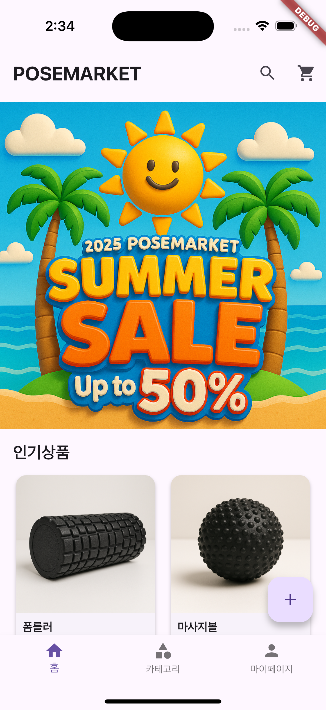
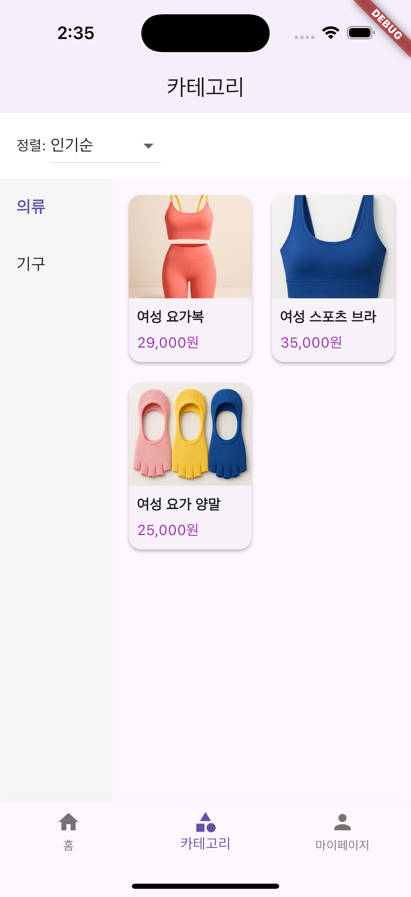
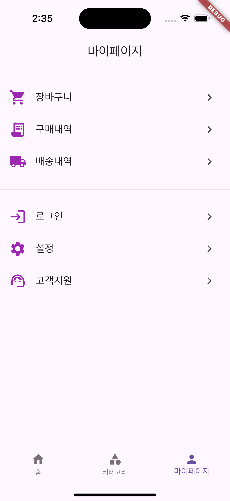

# POSEMARKET

쇼핑몰 앱 - Flutter 예제 프로젝트
쇼핑몰 이름 - POSEMARKET

## 소개

POSEMARKET은 폼롤러, 요가의류, 운동기구 등 다양한 피트니스 상품을 검색하고 구매할 수 있는 모바일 앱입니다.

## 주요 기능

- 인기상품, 신상품 둘 다 그리드로 진열
- 상품명/설명/가격/이미지 등록 및 수정
- 3자리마다 쉼표로 가격 포맷
- 상품 실시간 검색
- 장바구니 및 구매 기능
- 마이페이지(장바구니, 주문내역, 설정 등)

## 도전 기능 구성

- 카테고리 페이지 추가
- 카테고리 페이지에서 인기상품/가격순 상품정렬
- 홈 화면 상단 '검색' 아이콘에서 상품 검색 기능 추가
- 장바구니에서 선택상품 or 전체상품 삭제 기능 추가
- 마이페이지 구현
- 마이페이지 기능은 장바구니 기능 제외하고는 메뉴를 구성만 해 둠

## 스크린샷

홈화면 예시:

카테고리 화면 예시:

마이페이지 화면 예시:

